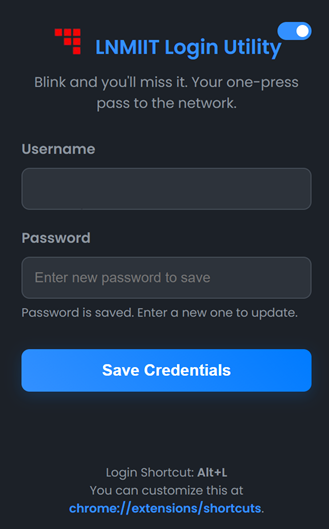

# LNMIIT Login Utility


A lightweight and efficient browser extension for Chrome and Chromium-based browsers to automate the login process for the LNMIIT (LNM Institute of Information Technology) network portal.

## The Problem
Tired of manually entering your username and password every time you're re-directed to the captive portal at `172.22.2.6`? This extension is for you.

## The Solution
This utility securely stores your credentials in your browser's local storage and provides a simple keyboard shortcut (`Alt+L`) to instantly log you in when the portal page appears.

It's designed to be:
- **Fast:** No more typing. Just press the shortcut.
- **Secure:** Your password is saved locally on your machine and is never exposed.
- **Efficient:** The extension only activates on the specific login page and uses minimal resources. It doesn't monitor your browsing activity.

## Installation

### From Source (for Developers)
1.  **Clone the repository:**
    ```bash
    git clone <repository-url>
    ```
2.  Open your Chrome/Brave browser and navigate to `chrome://extensions`.
3.  Enable **Developer mode** (toggle switch in the top-right corner).
4.  Click **Load unpacked**.
5.  Select the folder where you cloned the repository.

## How to Use

1.  **Save Your Credentials:**
    -   Click the extension icon in your browser's toolbar.
    -   Enter your username and password for the LNMIIT network.
    -   Click "Save Credentials".

2.  **Login:**
    -   When you are redirected to the college login page, simply press **`Alt+L`**.
    -   The extension will automatically fill in your details and log you in.

3.  **Customize Shortcut (Optional):**
    -   You can change the default shortcut by navigating to `chrome://extensions/shortcuts`.

## For Developers

### File Structure
```
.
├── background.js     # Service worker for handling commands and events
├── content.js        # Injected into the login page to perform the login
├── manifest.json     # The core extension manifest file
├── popup.html        # UI for the extension's popup
├── popup.css         # Styling for the popup
├── popup.js          # Logic for the popup (saving credentials)
├── README.md         # This file
└── images/
    ├── icon16.png
    ├── icon48.png
    └── icon128.png
```

### Contributing
Contributions are welcome! If you have ideas for new features or improvements, feel free to fork the repository, make your changes, and submit a pull request.

---
*This extension was created to solve a simple problem and make life a little easier for students at LNMIIT.*
