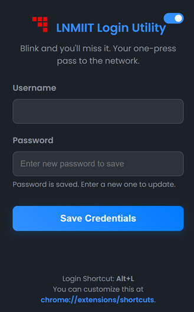

# LNMIIT Login Utility

A lightweight browser extension for Chrome and Chromium-based browsers to automate login for the LNMIIT network captive portal (`172.22.2.6`).

<p align="center">
  
</p>

## Features

- Fast authentication: Press `Alt+L` to instantly fill and log into the LNMIIT captive portal (`172.22.2.6`).
- Local and offline: Credentials are saved securely in your browser's local storage (`chrome.storage.local`) and never leave your machine.
- Theme support: Built-in dark and light mode toggle.
- Lightweight: Manifest V3 with minimal resource footprint.

## Installation

1. Clone or download this repository:
   ```bash
   git clone https://github.com/pragyan-srivastava/lnmiit-login-utility.git
   ```
2. Open your browser and go to the extensions page:
   - Chrome: `chrome://extensions`
   - Brave: `brave://extensions`
   - Edge: `edge://extensions`
3. Enable **Developer mode** (toggle switch in the top-right corner).
4. Click **Load unpacked** (top-left button).
5. Select the folder containing this repository.
6. (Optional) Pin the extension to your browser toolbar for quick access.

## How to Use

1. Click the extension icon in your browser toolbar.
2. Enter your username and password, then click **Save Credentials**.
3. When you are redirected to the LNMIIT captive portal page, press **`Alt+L`**. The extension will automatically fill your credentials and log you in.

### Customizing the Shortcut

To change the keyboard shortcut from `Alt+L`:
1. Navigate to `chrome://extensions/shortcuts` in your browser.
2. Find **LNMIIT Login Utility**.
3. Set your preferred hotkey.

## Privacy & Security

- Credentials are saved solely in the browser's isolated `chrome.storage.local`.
- No analytics, tracking, or network requests to external servers.
- Permissions are scoped specifically to the captive portal domain (`https://172.22.2.6/`).

## File Structure

```
├── manifest.json     # Manifest V3 extension configuration
├── popup.html        # Extension popup interface
├── popup.css         # Popup styles and themes
├── popup.js          # Credential storage and popup controls
├── background.js     # Service worker for shortcuts and portal detection
├── content.js        # Content script for autofill and login submission
├── images/           # Extension icons
└── README.md
```

## License

MIT
