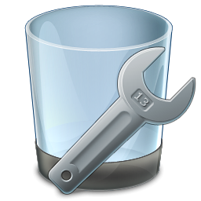
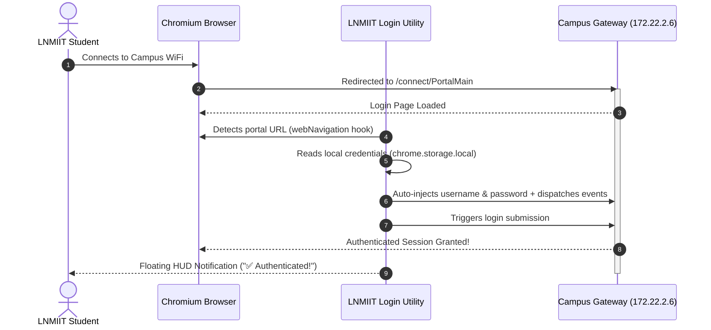

<div align="center">

  

  # LNMIIT Login Utility ⚡

  **Blink and you're in. Zero-touch, lightning-fast authentication for the LNMIIT campus network portal.**

  [](CHANGELOG.md)
  [](manifest.json)
  [](LICENSE)
  [](docs/INSTALLATION.md)
  [](docs/INSTALLATION.md)
  [](CONTRIBUTING.md)

  <br>

  [**⚡ 1-Click Install**](#-1-click-fast-installation) •
  [**✨ Features**](#-features) •
  [**🔒 Security & Privacy**](#-security--privacy-guarantee) •
  [**📖 Detailed Setup**](docs/INSTALLATION.md) •
  [**🤝 Contributing**](CONTRIBUTING.md)

</div>

---

## 📌 The Problem vs. The Solution

<div align="center">

| ❌ The Old Campus Experience | ✅ With LNMIIT Login Utility |
| :--- | :--- |
| Getting redirected to `172.22.2.6/connect/PortalMain` multiple times a day | **Zero-touch background auto-login** on page load |
| Manually typing your roll number & complex network password every single time | Stored securely in your **browser's sandboxed local storage** |
| Typos causing failed attempts and locked WiFi sessions | **Instant visual validation** & password visibility peek |
| Clunky bookmarking or typing the captive portal IP | **One-click "Open Portal"** button directly in the extension |
| Re-authenticating after device sleep or hostel WiFi switch | Just press **`Alt + L`** (or `⌥ + L` on Mac) anywhere! |

</div>

---

## ✨ Features

- ⚡ **Zero-Click Auto-Login**: The moment your browser hits `172.22.2.6/connect/PortalMain`, the utility instantly auto-fills and submits your credentials. You don't even have to lift a finger.
- ⌨️ **Global Shortcut (`Alt + L`)**: Prefer manual control? Press `Alt + L` (Windows/Linux) or `⌥ + L` (macOS) to authenticate in a split second.
- 🎨 **Modern Glassmorphic UI**: Sleek, distraction-free extension popup featuring curated typography, smooth micro-animations, and instant **Dark & Light mode** switching.
- 🚀 **1-Click Native Installers**: Zero dependencies, zero compilation. Run a single script on Windows (`install.bat`) or macOS/Linux (`install.sh`) to install or preload into your browser in seconds.
- 🔒 **100% Offline & Private**: Zero external analytics, zero tracking, and zero remote servers. Your credentials never leave your local machine.
- 👁️ **Password Peek**: Toggle password visibility so you never store a mistyped password.
- 🟢 **Live Portal Tab Detection**: Pulsing status badge detects whether your active tab is currently on the LNMIIT captive portal.
- 🌐 **Multi-Browser Compatibility**: Fully tested on **Google Chrome**, **Brave**, **Microsoft Edge**, **Arc**, **Opera GX**, and **Vivaldi**.

---

## 🚀 1-Click Fast Installation

We built automated, interactive installer scripts so you never have to hunt for folders or struggle with developer settings.

### 🪟 Windows (Single-Click)
1. Download or clone this repository:
   ```bash
   git clone https://github.com/pragyan-srivastava/lnmiit-login-utility.git
   ```
2. Double-click **`install.bat`** (or run `.\install.ps1` in PowerShell).
3. The script will:
   - Detect Google Chrome, Brave, and Edge on your PC.
   - Automatically copy the extension directory path to your Windows clipboard.
   - Open your browser's extensions page with clear guidance!

> **💡 Pro-Tip:** Option `[2]` in `install.bat` directly launches Chrome/Brave with the extension preloaded immediately!

---

### 🍎 macOS & 🐧 Linux (Single Script)
1. Clone the repository and open your terminal:
   ```bash
   git clone https://github.com/pragyan-srivastava/lnmiit-login-utility.git
   cd lnmiit-login-utility
   ```
2. Run the installer:
   ```bash
   chmod +x install.sh
   ./install.sh
   ```
3. The script automatically copies the folder path to your clipboard (`pbcopy` on Mac, `xclip`/`wl-copy` on Linux) and opens `chrome://extensions` ready for loading.

---

### 🛠️ Manual Installation (30 Seconds)
If you prefer loading it yourself without scripts:
1. Open your browser and navigate to `chrome://extensions` (or `brave://extensions`, `edge://extensions`).
2. Toggle **Developer mode** **ON** (top-right switch).
3. Click **Load unpacked** (top-left button).
4. Select the `LNMLoginUtility` folder.
5. Click the puzzle icon (🧩) in your browser toolbar and pin **LNMIIT Login Utility**.

*For complete step-by-step instructions on Arc, Opera, and Vivaldi, check out the [Full Installation Guide](docs/INSTALLATION.md).*

---

## 🎯 How to Use

1. **Save Your Credentials**:
   - Click the extension icon in your browser toolbar.
   - Enter your LNMIIT Roll Number (e.g. `23ucc001`) and network password.
   - Click **Save Credentials**.
2. **Connect & Browse**:
   - Whenever you connect to campus WiFi, simply open any website or go to `https://172.22.2.6/connect/PortalMain`.
   - The extension will auto-submit your credentials with a floating confirmation badge!
   - You can also hit **`Alt + L`** anytime to trigger login manually.
3. **Customize Your Shortcut (Optional)**:
   - Click **"Change"** inside the extension popup or visit `chrome://extensions/shortcuts` to bind any custom hotkey you prefer (e.g., `Ctrl+Shift+L`).

---

## 🏗️ Architecture & How It Works


```mermaid
sequenceDiagram
    autonumber
    actor User as LNMIIT Student
    participant Browser as Chromium Browser
    participant Ext as LNMIIT Login Utility
    participant Portal as Campus Gateway (172.22.2.6)

    User->>Browser: Connects to Campus WiFi
    Browser->>Portal: Redirected to /connect/PortalMain
    activate Portal
    Portal-->>Browser: Login Page Loaded
    Ext->>Browser: Detects portal URL (webNavigation hook)
    Ext->>Ext: Reads local credentials (chrome.storage.local)
    Ext->>Portal: Auto-injects username & password + dispatches events
    Ext->>Portal: Triggers login submission
    Portal-->>Browser: Authenticated Session Granted!
    Ext-->>User: Floating HUD Notification ("✅ Authenticated!")
    deactivate Portal
```

---

## 🔒 Security & Privacy Guarantee

When handling network credentials, trust and transparency are non-negotiable.

- **100% Local Storage:** Your credentials are saved strictly inside your browser's sandboxed [`chrome.storage.local`](https://developer.chrome.com/docs/extensions/reference/storage/#property-local).
- **Zero Telemetry / No External Calls:** There are no analytics, tracking pixels, or remote servers. Open Chrome DevTools Network Tab and see for yourself: the extension makes **zero** outbound network requests.
- **Strict Host Scoping:** In accordance with Manifest V3 security standards, the extension's host permissions are restricted **exclusively** to `*://172.22.2.6/*`. It has zero access to any other website you visit.
- **Auditable & Open-Source:** Every single line of code is plain, readable JavaScript. No minification, no obfuscation.

👉 Read the complete [Security & Threat Model Audit](docs/SECURITY.md).

---

## 📂 Repository Layout

```
.
├── manifest.json            # Manifest V3 configuration & permission scoping
├── popup.html               # Modern glassmorphic extension popup
├── popup.css                # CSS custom properties, dark/light themes, animations
├── popup.js                 # Popup controller & state management
├── background.js            # Background service worker (shortcuts & portal detection)
├── content.js               # Isolated content script for DOM automation & HUD toast
├── install.bat              # Windows 1-click batch installer
├── install.ps1              # Windows PowerShell interactive setup
├── install.sh               # macOS & Linux installation script
├── scripts/
│   ├── package.bat          # Windows release packager
│   ├── package.ps1          # PowerShell release packager
│   └── package.sh           # Bash release packager
├── docs/
│   ├── INSTALLATION.md      # Detailed installation guide for all browsers
│   └── SECURITY.md          # Security audit & privacy documentation
├── images/
│   ├── icon16.png           # Extension toolbar icon (16x16)
│   ├── icon48.png           # Extension icon (48x48)
│   ├── icon128.png          # High-resolution extension icon (128x128)
│   └── screenshot.png       # Preview showcase
├── CHANGELOG.md             # Release history and updates
├── CONTRIBUTING.md          # Contribution guidelines
└── LICENSE                  # MIT License
```

---

## ❓ Frequently Asked Questions (FAQ)

<details>
<summary><b>1. Why does my browser show a "Not Secure" warning on 172.22.2.6?</b></summary>
The campus captive portal uses a local, internal IP address with a self-signed SSL certificate. This is standard for campus network gateways. Simply click <b>Advanced &rarr; Proceed to 172.22.2.6 (unsafe)</b> once, and the extension will handle logins seamlessly.
</details>

<details>
<summary><b>2. What happens when I change my LNMIIT password?</b></summary>
Simply click the extension icon in your toolbar, enter your new password, and click <b>Save Credentials</b>. The new password will instantly overwrite the previous one.
</details>

<details>
<summary><b>3. Can I use this in Incognito / Private mode?</b></summary>
Yes! Go to <code>chrome://extensions</code>, click <b>Details</b> on LNMIIT Login Utility, and toggle <b>"Allow in Incognito"</b>.
</details>

<details>
<summary><b>4. Does this drain battery or slow down my browser?</b></summary>
Not at all. The extension runs on Manifest V3 with an event-driven background service worker that sleeps when inactive and uses zero CPU or RAM until the portal page is loaded.
</details>

---

## 🤝 Contributing

Contributions make the open-source community an amazing place to learn, inspire, and create! Any contributions to improve the utility for LNMIIT students are **greatly appreciated**.

1. Fork the Project
2. Create your Feature Branch (`git checkout -b feature/AmazingFeature`)
3. Commit your Changes (`git commit -m 'feat: Add AmazingFeature'`)
4. Push to the Branch (`git push origin feature/AmazingFeature`)
5. Open a Pull Request

See [CONTRIBUTING.md](CONTRIBUTING.md) for detailed guidelines.

---

## 📜 License

Distributed under the **MIT License**. See [`LICENSE`](LICENSE) for more information.

---

<div align="center">
  <sub>Built with ❤️ for the students of The LNM Institute of Information Technology (LNMIIT).</sub>
  <br>
  <sub>If this utility saved you time, don't forget to <b>★ Star this repository</b>!</sub>
</div>
